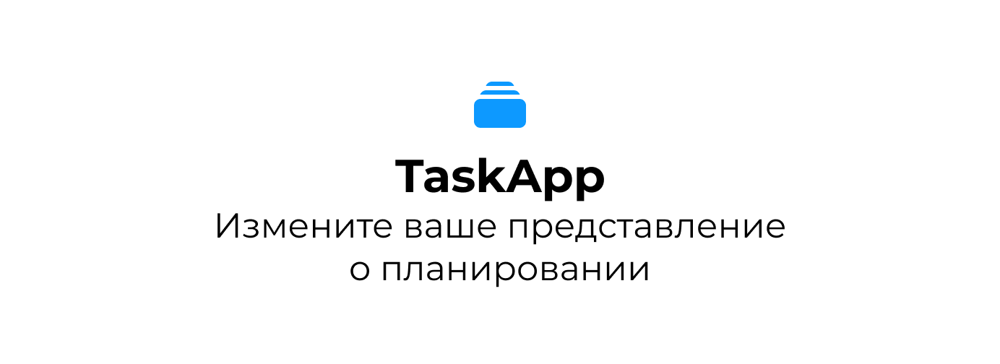
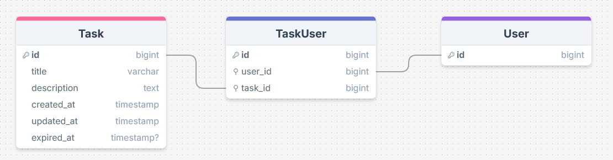
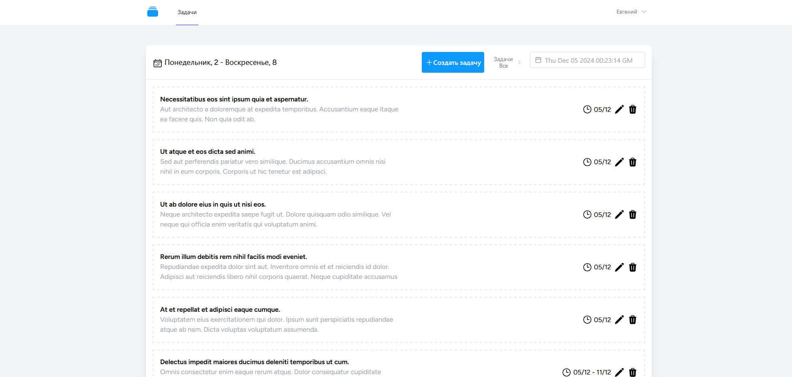
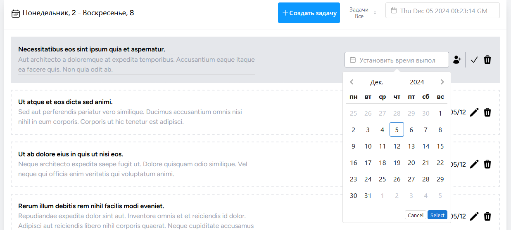
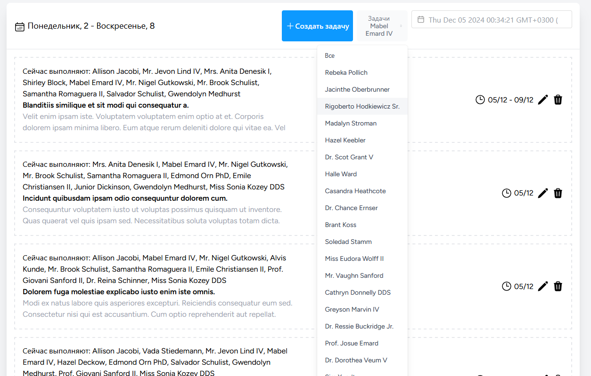

# TaskApp

## Зависимости
* [Laravel dependencies](https://laravel.com/docs/10.x/deployment#server-requirements)
## Использованные библиотеки
* Laravel Jetstream 10
* [Laravel-IDE-helper](https://github.com/barryvdh/laravel-ide-helper)
* [Heroicons](https://www.npmjs.com/package/heroicons)
* [Vue DatePicker](https://vue3datepicker.com/)
* [Референс дизайна](https://dribbble.com/shots/24460374-List-Task-Project-Tracker)
## Структура БД

[DrawSQL.app](https://drawsql.app/teams/catarsys/diagrams/taskapp)
## Установка и запуск
## Docker
Установка через Docker описывается [тут](docker/README.md).
## Локально (non production)
1. Клонировать репозиторий
```bash
git clone https://github.com/Tomut0/task-app
cd task-app
```
2. Установить зависимости
```bash
composer install
```
3. Создать файл `.env` и скопировать содержимое из `.env.example`
```
cp .env.example .env
```
4. Создать базу данных и настроить подключение в файле `.env`
5. Сгенерировать ключ приложения
```bash
php artisan key:generate
```
7. Выполнить миграции
```bash
php artisan migrate
```
8. Опционально: запустить механизм заполнения изначальных данных (seeders):
```
php artisan db:seed
```
8. Запустить php-сервер
```bash
php artisan serve
```
9. Скомпилировать ассеты 
```bash
npm run build
```
10. Перейти по адресу `http://127.0.0.1:8000`

## Скриншоты



